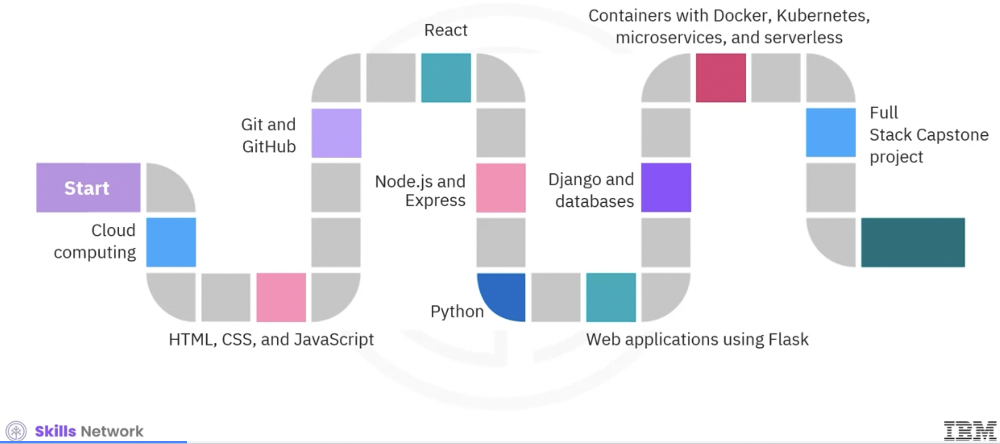
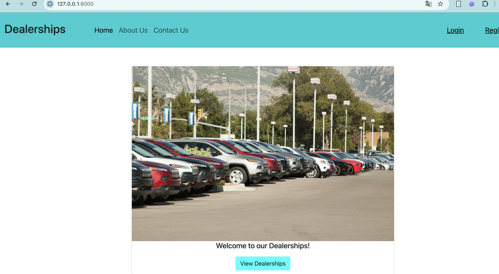

# Full Stack Application Development Capstone Project

[Full Stack Application Development Capstone Project
](https://www.coursera.org/learn/ibm-cloud-native-full-stack-development-capstone/home/info)

## Tech stack


## Course objective
1. Module 1: 
   - Project scenario, forking, cloning, 
   - static web page
2. Module 2
   - Add user management (FE: React, JS, html), BE (Django); 
   - Add session management
3. Module 3: 
    - Create backend services in JavaScript, e.g: database/app.js
    - Build the Docker app 
    - Containerize MongoDB and Express server using docker-compose.yml
    - Deploy sentiment analyzer microservice using IBM Cloud Code Engine
4. Module 4
    - Create dynamic pages for details and reviews
    - Create user-friendly and aesthic front-end pages to provide it to users
5. Module 5
    - Implement CI/CD with Github workflow for linting
    - Make Epress-Mongo server running on Docket
    - Sentiment analyzer microservice
    - Make app available to run on a container
    - Add deploy artifacts to app so that it can be managed by Kubernetes (K8)
6. Module 6
   - Submission
   - peer grade review
   
## Project requirement
A national car dealership with local branches spread across the United States recently conducted a market survey. One of the suggestions that emerged from the survey was that customers would find it beneficial if they could access a central database of dealership reviews across the country.

You are a new hire at the company. You are assigned the task of building a website that allows new and existing customers to look up different branches by state and look at customer reviews of the various branches. Customers should be able to create an account and add their review for any of the branches. The management hopes this will bring transparency to the system and also increase the trust customers have in the dealership.

After thorough research and brainstorming, the team developed use cases for anonymous, authorized, and admin users.

### Use cases for anonymous users:
- View the Contact Us page.
- View the About Us page.
- View the list of dealerships.
- Filter the list of dealerships by state:
    - Select Show all or a specific state from the State dropdown on the dealership page.
    - View all states if nothing is selected in the dropdown.
    - View a table of dealerships for the selected state when the form is submitted.
- Click on a dealership to view the reviews for that dealership on the details page with each review displayed on a bootstrap card.
- Log in using their credentials.

### Use cases for authorized users:
In addition to the above, authorized users should be able to write a review for any dealership on the dealership's page. In order to enable authorized users to write their reviews:

- A Review button should be provided against each dealer listed in the dealership table.
- Clicking on the Review button should take the user to the review page.
- Filling the form on the review page and submitting it should add the review.
```python  
{
  "user_id": 1, => from Django
  "name": "Berkly Shepley", => from Django
  "dealership": 15, => from the form
  "review": "Total grid-enabled service-desk", => form textbox
  "time": "", => current time
  "purchase": true, => form checkbox
  "purchase_date": "07/11/2020", => form calendar (bootstrap)
  "car_make": "Audi", => from django dropdown
  "car_model": "A6", => from django dropdown
  "car_year": 2010 => form django dropdown
  }
```
On submission, the user should be taken back to the dealership detail page with the submitted review featured at the top of the reviews list, sorted on time.


### Use cases for admin users:
-  Log in to the admin site with a predefined username and password.
- Add new make, model, and other attributes.
  Your organization has assigned you as the Lead Full-Stack Software Developer on this project. Your job is to develop this portal as part of your Capstone project by following best practices for Full-Stack software development.


# Module 1: Create static page About us, Contact us
The Django app will be mainly used for user management and authentication, managing car models and makes, and routing other MongoDB services for dealership and customer reviews. You will build this Django app and related services in a phased manner along the capstone course.

In this module, you are asked to perform the following tasks:

- Fork the GitHub repo containing the project template.
- Clone your forked repository.
- Run the Django app on the development server.
- Add a navigation to the website using Bootstrap.
- Add an "About Us" static page.
- Add a "Contact Us" static page.
  Follow the instructional Skill Network lab to complete the above tasks step by step.

## Step 1: Clone and ckeck the main app running
As part of the project, your first task is to run and test its main Django application. You are given a skeleton of the Django application as a starting point.

### Fork and Clone the repository
- Navigate to this [repo](https://github.com/ibm-developer-skills-network/xrwvm-fullstack_developer_capstone): link and create a fork of the repository that includes essential starter code required for this project.

- Go to your forked repository.

- Copy the git clone URL of the skeleton repository that you forked into your account.
- Follow [instructions "Add static page"](./lectures/Module1_add_static_pages.pdf)
### Working with light-weight, serverless db: sqlite3

```sql
sqlite3 db.sqlite3 # connect to db
.table # list all tables
.exit # quit 
```
### Run the Django app on development server


# Module 2: User Management Overview
Now, you have the initial Django application built and deployed. In the next step, the admins of the dealership will review the app to identify users and manage their accesses based on roles (such as anonymous users or registered users). To accomplish this, you need to add authentication and authorization, that is, user management, to the app. In this lesson, you need to perform the following tasks to add the user management feature:

- Create a superuser for your app [Admin login](http://127.0.0.1:8000/admin/)
- Build the Client side and configure it.
- Check the Client configuration.
- Add a Login view to handle login requests.
- Add a Logout view to handle logout requests.
- Add a Registration view to handle Sign-up requests.

- Follow the [instructional lab](./lectures/) to complete the above tasks step by step.
### Requirement to run npm command
#### Install Node16 using nvm:
- Install [nvm](https://github.com/nvm-sh/nvm)
- Install node 16 that is compatible with Mac 11.3.1
- Create a simple [node web server](https://nodejs.org/docs/latest/api/synopsis.html#example)
```
curl -o- https://raw.githubusercontent.com/nvm-sh/nvm/v0.40.1/install.sh | bash
zsh: source ~/.zshrc # refress zsh file
nvm --version # check if nvm is installed
nvm ls-remote # fetch the list all node versions
nvm install <version-of-node-in-the-list>
node --version # check installed version
npm --version
nvm ls # give info of installed version on local
nvm use <version-want-to-use> # switch between different node versions

# create any folder to store your .js server
mkdir nodeDemo
cd nodeDemo
touch hello.js
ls
code hello.js # open .js in VS code 
# insert code 

const http = require('node:http');

const hostname = '127.0.0.1';
const port = 3000;

const server = http.createServer((req, res) => {
res.statusCode = 200;
res.setHeader('Content-Type', 'text/plain');
res.end('Hello, World!\n');
});

server.listen(port, hostname, () => {
console.log(`Server running at http://${hostname}:${port}/`);
});

###########################
node hello.js # to run server
```
#### Install Node: this way does not work for Mac 11.3.1.
```
brew install node
which npm # Example output: /usr/local/bin/npm
export PATH=$PATH:<node's bin path>
# e.g: export PATH=$PATH:/usr/local/bin
source ~/.bashrc
npm -v # check if the setting path is working
```

### Users
Some users are available. You can use some [free temporary email](https://10minutemail.com/)
- admin/admin

# How to build and run Node and Django
1. If there is change in FE --> build it again
2. If there is change in model, Db --> migrate them
2. Then run Django app
```
cd <frontend folder where there is package.json>
npm run build
cd <project Djang folder where there is manage.py>
python3 manage.py check

python3 manage.py makemigrations
python3 manage.py migrate

python3 manage.py runserver
```
# Module 3
## Make Django app talk to MongoDB (NoSQL) using backend service developed in JavaScript
- Working with Mongoose to provide API endpoints
> Node app use *mongoose* to interact iwth the MongoDB
- We write backend services in an Express app and deploy it on IBM Code Engine.
- Students are provided 2 schema files: dealerships.js and reviews.js and their data in json files.
``` 
# review.js
const mongoose = require('mongoose');

const Schema = mongoose.Schema;

const reviews = new Schema({
	id: {
    type: Number,
    required: true,
	},
	name: {
    type: String,
    required: true
  },
  dealership: {
    type: Number,
    required: true,
  },
  review: {
    type: String,
    required: true
  },
  purchase: {
    type: Boolean,
    required: true
  },
  purchase_date: {
    type: String,
    required: true
  },
  car_make: {
    type: String,
    required: true
  },
  car_model: {
    type: String,
    required: true
  },
  car_year: {
    type: Number,
    required: true
  },
});

module.exports = mongoose.model('reviews', reviews);

``` 

And data records "reviews.json"
```
{
  "reviews": [
    {
      "id": 1,
      "name": "Berkly Shepley",
      "dealership": 15,
      "review": "Total grid-enabled service-desk",
      "purchase": true,
      "purchase_date": "07/11/2020",
      "car_make": "Audi",
      "car_model": "A6",
      "car_year": 2010
    },
    {
      "id": 2,
      "name": "Gwenora Zettoi",
      "dealership": 23,
      "review": "Future-proofed foreground capability",
      "purchase": true,
      "purchase_date": "09/17/2020",
      "car_make": "Pontiac",
      "car_model": "Firebird",
      "car_year": 1995
    },
  ...
  ]
}
```

- Build a docker app
```
docker ps -a / check all status containers
docker images // list images

docker volume ls // list volume
docker inspect <volumn-id> # check mounting 
 
docker build . -t nodeapp # create images for Node app
docker-compose up # create 2 containers for Mongo (download image from Docker hub) and Node app (from local images)

# after finishing your test, you should stop them
docker ps

# only stop the service (not delete)
docker stop <three-first-digit container id>

# remove all services
docker-compose down

# remove services and their volumes (persistent storage) of these service
docker-compose down --volumes
docker volume prune # delete anonymous volume auto created by Docker


# remove image
docker rmi <image_name> # remove image


```

Test all endpoints by replacing URLs in address bar
```
docker-compose up // to run Node app and MongoDB in containers
# alternative, to start server locally
node app.js

http://localhost:3030/ --> Welcome to the Mongoose API
http://localhost:27017/ --> It looks like you are trying to access MongoDB over HTTP on the native driver port.
http://localhost:3030/fetchReviews
http://localhost:3030/fetchReviews/dealer/15

curl http://localhost:3030/fetchReviews/dealer/15
curl http://localhost:3030/fetchDealers
curl http://localhost:3030/fetchDealer/3

```

### Re-Build and Restart services after changing code
```
# option 1 --> issue: existing container is not updated with new changes in app.js
docker-compose up --build # build and restart

# option 2: work ok, but not a good practice to fix image name
docker-compose down --volumes
docker rmi nodeapp
docker build . -t nodeapp
docker-compose up
docker-compose down --volumes

```

#### option 3 (RECOMMEND): modify docker-compose to build Node app
```
# modify docker-compose file
  api:
    #image: nodeapp # remove the prebuild image
    build: . # tell Docker to build the image for Node app before running the api service, ./ is the current dir where Dockerfile is
    ports:
      - 3030:3030
    depends_on: # depends_on ensures mongo_db container running first and then starts the api container.
      - mongo_db
      
Ctr + C: to stop all services running (if yes)

# rebuild nodeapp image (even thought it exists nodeapp:latest) because the code in app.js has changed
# output --> naming to docker.io/library/database-api
docker-compose build 
 

docker-compose up # it will use the new image it build "database-api" to start a service for Node app.
```

## Check MongoDb
```
# start container for MongoDB
docker exec -it db_container mongosh # mongo_db
use dealershipsDB # connect to DB name <>
show collections
db.<table-name>.find().pretty()
```
# Reference
1. [CSS syntax explained](https://www.wa4e.com/code/css/)
2. 